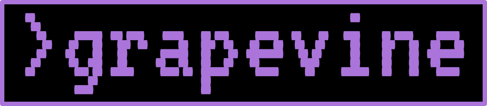
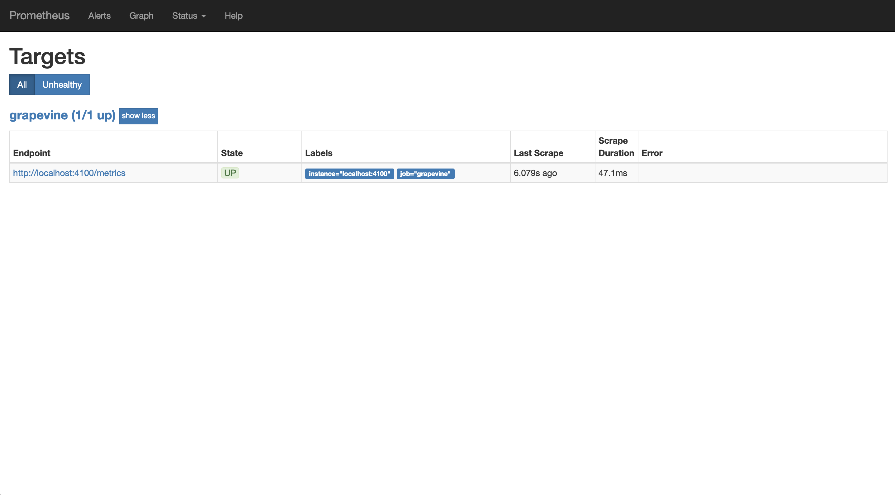
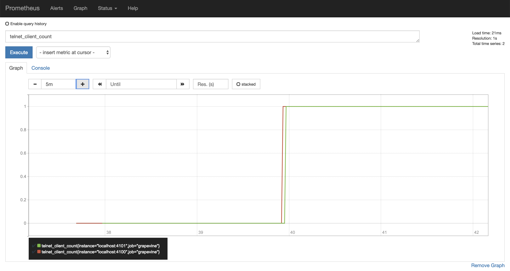
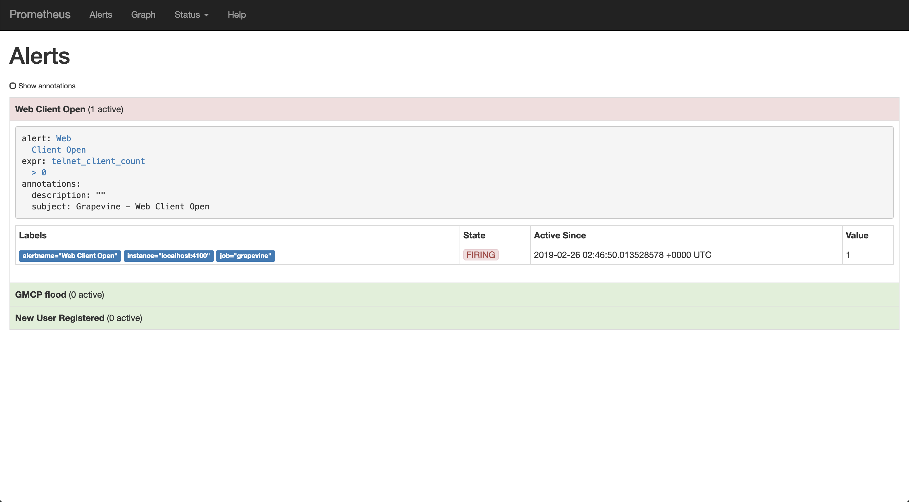
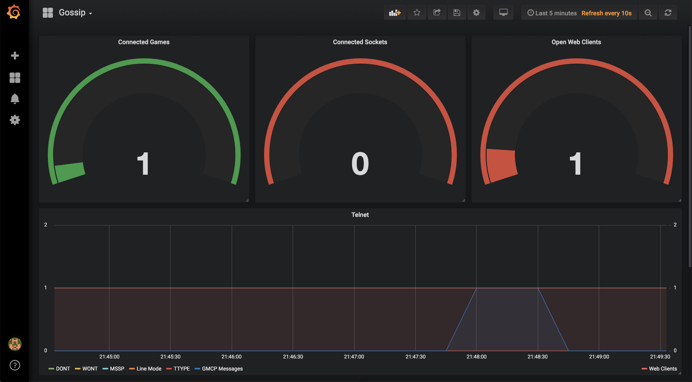

# Monitoring Your Elixir Application with Prometheus


Eric Oestrich
SmartLogic

^ Look through grapevine source

^ Simple local prometheus setup, excercise to viewer to stand up remote instance
  - Link to the ansible role we use

^ Show connecting a new client changes a dashboard

---

# SmartLogic


We build web and mobile applications

Have a project? We can help.
[smartlogic.io](https://smartlogic.io/) // [contact@smartlogic.io](mailto:contact@smartlogic.io)

---


- Context
- Setup
- Metrics
- Instrument
- Prometheus
- Grafana
- Alerting

---

# Prometheus


From metrics to insight

[prometheus.io](https://prometheus.io)


---

# Grafana


The open platform for beautiful analytics and monitoring

[grafana.com](https://grafana.com/)


---

# Other Options


- NewRelic
- CloudWatch
- DataDog
- Scout
- statsd
- Graphite
- ...

---

# Grapevine


Community site for text based games

[grapevine.haus](https://grapevine.haus)
[https://github.com/oestrich/grapevine](https://github.com/oestrich/grapevine)



^ Show a MUD through the grapevine web client, run around, generate lots of metrics, chat

---

# Setup


mix.exs

```elixir
[
  {:prometheus_ex, "~> 3.0"},
  {:prometheus_plugs, "~> 1.1"},
  {:telemetry, "~> 0.3"},
]
```

---

# Define Your Metrics Exporter


```elixir
defmodule Metrics.PlugExporter do
  use Prometheus.PlugExporter
end
```

---

# Add to Endpoint


[.code-highlight: 3]

```elixir
defmodule Web.Endpoint do
  # ...
  plug Metrics.PlugExporter
  # ...
end
```

---

# Metrics Setup


```elixir
defmodule Metrics.Setup do
  def setup do
    Metrics.PlugExporter.setup()
  end
end
```

---

# Add Setup to Your Application


[.code-highlight: 4]

```elixir
defmodule Grapevine.Application do
  def start(_type, _args) do
    # ...
    Metrics.Setup.setup()
    # ...

    Supervisor.start_link(children, opts)
  end
end
```

---

# Metrics!


Available at
[http://localhost:4100/metrics](http://localhost:4100/metrics)

```
# TYPE erlang_vm_atom_count gauge
# HELP erlang_vm_atom_count The number of atom ...
erlang_vm_atom_count 38398
# TYPE erlang_vm_atom_limit gauge
# HELP erlang_vm_atom_limit The maximum number ...
erlang_vm_atom_limit 1048576

# Many more
```

---

## Custom Instrumentation


---

# Our first Instrumenter


^ lib/metrics/account_instrumenter.ex

^[.code-highlight: 5-8]

```elixir
defmodule Metrics.AccountInstrumenter do
  use Prometheus.Metric

  def setup() do
    events = [
      [:create],
      [:session, :login],
      [:session, :logout],
    ]

    Enum.each(events, &setup_event/1)
  end
end
```

---

# Our first Instrumenter


^ lib/metrics/account_instrumenter.ex

^[.code-highlight: 5-8]

```elixir
defmodule Metrics.AccountInstrumenter do
  defp setup_event(event) do
    name = Enum.join(event, "_")
    name = "grapevine_accounts_#{name}"

    Counter.declare(
      name: String.to_atom("#{name}_total"),
      help: "Total of account event #{name}"
    )

    #...
  end
end
```

---

# Prometheus Naming


- Prefix with application name
- Use base units (seconds not milliseconds)
- Suffix with unit

[Prometheus Docs](https://prometheus.io/docs/practices/naming/)

---

# Add to our Setup module


[.code-highlight: 2]

```elixir
def setup do
  Metrics.AccountInstrumenter.setup()
  Metrics.PlugExporter.setup()
end
```

---


# Metrics

```
# TYPE grapevine_accounts_session_login_total counter
# HELP grapevine_accounts_session_login_total Total count ...
grapevine_accounts_session_login_total 0
```

---

# Triggering Events


0.3.0

```elixir
:telemetry.execute([:grapevine, :accounts, :create], 1)
```

---

# Triggering Events


0.4.0

```elixir
:telemetry.execute([:grapevine, :accounts, :create],
  %{value: 1})
```

---

# Register Telemetry Callbacks


^ Show lib/metrics/account_instrumenter.ex

[.code-highlight: 11-13]

```elixir
defmodule Metrics.AccountInstrumenter do
  defp setup_event(event) do
    name = Enum.join(event, "_")
    name = "grapevine_accounts_#{name}"

    Counter.declare(
      name: String.to_atom("#{name}_total"),
      help: "Total of account event #{name}"
    )

    # [:grapevine, :accounts, :create]
    event = [:grapevine, :accounts | event]
    :telemetry.attach(name, event, &handle_event/4, nil)
  end
end
```

---

## attach vs attach_many


---

# Handling Events


```elixir
def handle_event(event, count, metadata, config)

def handle_event([:grapevine, :accounts, :create], _, _, _) do
  Logger.info("New account created!")
  Counter.inc(name: :grapevine_accounts_create_total)
end
```

---

# Concurrency


- `:telemetry.execute` runs in the process that calls it
- Prometheus counters/gauges/etc are tracked via public ETS tables

---

# Viewing our Metrics


- `/metrics`
- Prometheus server
- Grafana

---

# Basic Prometheus Setup


- Scrape configs
- Rules

---

# Scrape Config


```yaml
scrape_configs:
  - job_name: 'grapevine'
    static_configs:
    - targets: ['localhost:4100']
```

---




---




---

# Rules


```yaml
alert: New User Registered
expr: increase(grapevine_account_create_total[5m]) > 0
annotations:
  subject: "Grapevine - New user registered"
  description: ""
```

---




---

# Connecting Grafana


^ Exercise for the viewer

---

# Dashboards


^ Show a dashboard

---




---

# Demo


^ https://prometheus.io/docs/practices/naming/

^ Show flow from registering a new user - see that alert
Opening a web client, seeing that alert
Step through the code that makes that ^ possible

^ Telemetry disconnects your metrics on any failure of the handle_event function

^ Show more of the telemetry setup

---

# Twitch


Live dev streams every Monday at 12PM Eastern

[twitch.tv/smartlogictv](https://twitch.tv/smartlogictv)

---

# Smart Software


[podcast.smartlogic.io](https://podcast.smartlogic.io)


---

# Questions?


[twitter.com/ericoestrich](https://twitter.com/ericoestrich)
[github.com/oestrich](https://github.com/oestrich)
[smartlogic.io](https://smartlogic.io/)


