# All Aboard the Stateful Train

[.header: #FDDF26, line-height(.8), text-scale(2), Circular Std]
[.text: #FFFFFF, Circular Std]


Eric Oestrich
SmartLogic

---
[.header: #37A792, alignment(left), Circular Std]


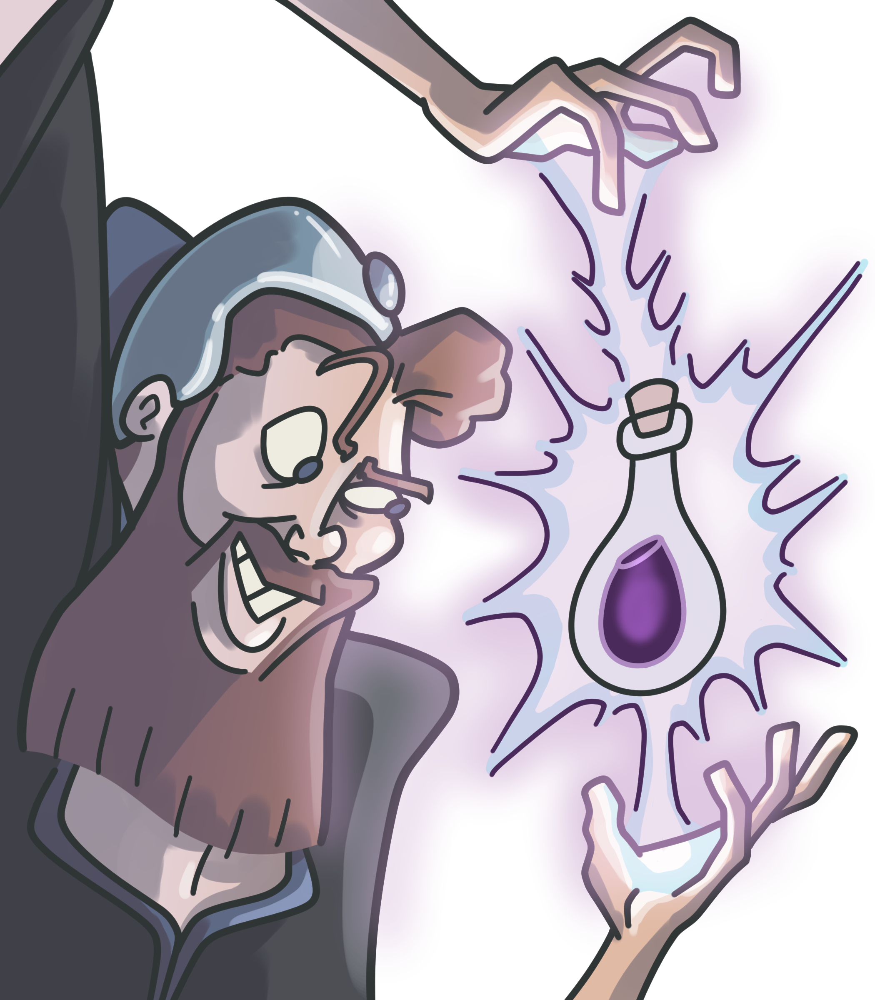


# Who am I?

Eric Oestrich
Wizard at SmartLogic

---
[.header: #37A792, alignment(left), Circular Std]


# Who is SmartLogic?

We build custom web and mobile apps.

Based in Baltimore, we've built over 150 apps since 2005.

---


# Agenda

- What does a standard application look like?
- Why would you go stateful?
- What does a stateful application look like?
- Is stateful better?
- Let's go stateful!

---


# Standard Application

---


# Standard Application

- Stateless HTTP
- Controllers go straight to the database
- Does not leverage OTP
- MVC, Rails-like

^ TODO How does data flow through this?

---


# Standard Application Examples

- Wordpress
- Hubspot
- Wikipedia
- Shopify

---


# Stateful Application

- Stateless HTTP
- Websockets/TCP connections
- Heavy use of OTP
- "Background" processes

^ TODO How does data flow through this? see later in the examples, just show a quick snippet up here first

---


# OTP and Processes

- Used to be Open Telecom Platform
- OTP is the standard library of Erlang
- GenServers, supervision trees, :ets, all the fun stuff
- Processes are the base building block of Erlang concurrency

---


# Supervision Tree

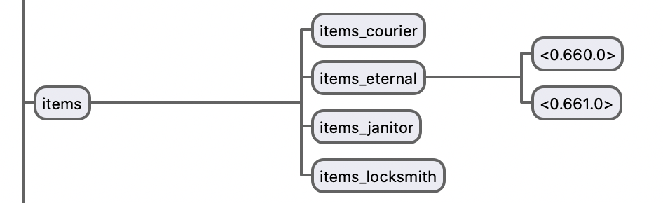

---


# Why Stateful?

---


# Why Stateful?

- We're on a platform that can handle it
- Local caches
- Processes working on state

---


## Did I mention Erlang is great at this?


[.footer: https://unsplash.com/photos/M5tzZtFCOfs]

---


# Let's review some stateful applications

^ Max and mid stateful

---

[.text: alignment(center)]


^ Stateless |-------------------*| Stateful

^ TODO graphic of stateless to stateful, exventure on the edge

---

[.text: alignment(center)]


# ExVenture

A MUD Server
[exventure.org](https://exventure.org)

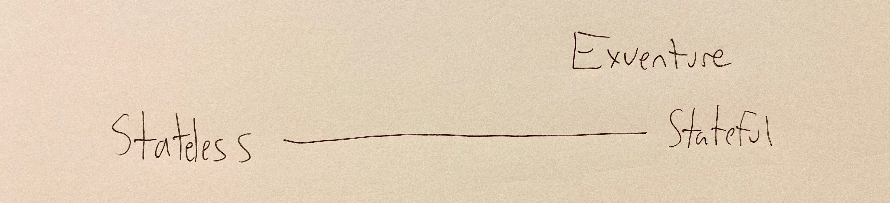

---


# What is a MUD?

- Multi-User [Dungeon](https://en.wikipedia.org/wiki/Dungeon_\(video_game\))
- Online text adventure
- Connects with telnet

^ 1976 for Dungeon

---


# What is a text adventure?

```
This is an open field west of a white house, with a boarded front door.
There is a small mailbox here.
A rubber mat saying 'Welcome to Zork!' lies by the door.

>
```

---


# MidMUD

The flagship ExVenture instance

[midmud.com](https://midmud.com)

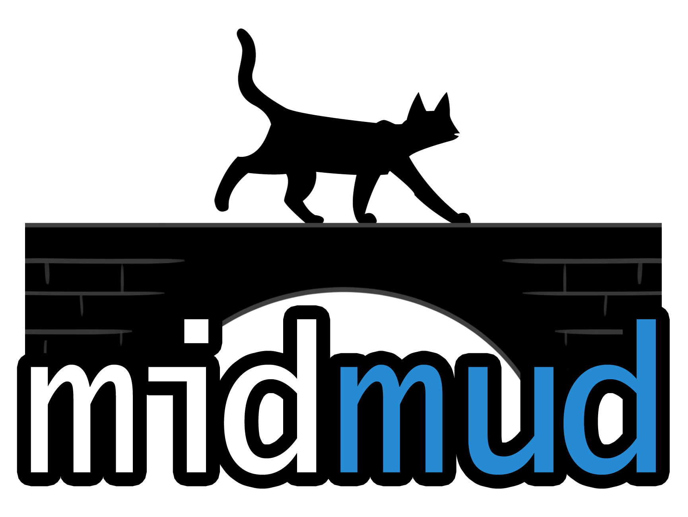

---


# Review of ExVenture

- A "living" world
- Everything is always on
- The database is there for startup
- Lots of inter-process communication

---


# Demo

^ TODO diagram of how actors work together - we'll see this later

---


# Could this be stateless?

---


# Not Really

- Poll based?
- Background worker that updated the world every X seconds?
- Gross

---


[.text: alignment(center)]


^ Stateless |---------*----------| Stateful

^ TODO graphic of stateless to stateful, grapevine in the middle

---


# Grapevine

[.text: alignment(center)]

MUD community site
[grapevine.haus](https://grapevine.haus)


---


# Grapevine

- Steam for MUDs
- Cross game chat
- Web client

---


# Review of Grapevine

- Close to a standard application
- State involved is websocket and telnet
- Caches

---


# Demo

- Game listings, stats
- Cross game chat
- Web client

---


# Could this be stateless?

---


# Possibly

- Chat applications _can_ poll based
- Live caches could hit the database
- Still gross

^ Hitting the db: data scale is very low

---


# Is stateful better?

^ Than a standard "rails" application

---


# Do I want this?

^ Maybe
^ When should I go stateful?

---


# Depends

---


# Pros

---


# Soft realtime capabilities

## Erlang is built for soft realtime

---


# Website feels "alive"

## Websockets can update your website without a refresh

^ Great example: live view

---


# Reduced Database Queries

## Less round trips to the database for faster response times

---


# Cons

---


# Requires heavy usage of OTP

## You must architect out how your application is laid out in memory

^ Not using the one given to you from Phoenix

---


# Caches are Hard™

## There are 2 hard problems in computer science: cache invalidation, naming things, and off-by-1 errors.

---


# Harder to Deploy

- Warm caches on boot
- Long lived connections will drop
  - How will you deal with this?
- Clustered applications need to handle a rolling restart

---


# Rolling Restart

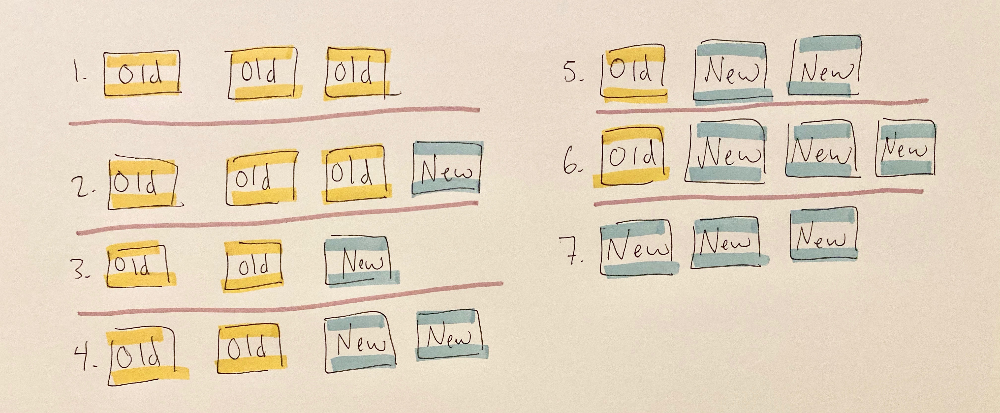

^ old and new code live together

---


# Here be Dragons

- Mailbox size
- Message passing *copies*
- Clustering woes


[.footer: https://unsplash.com/photos/vVKbHNhu2ZU]

^ this is a challenge to do and do well

---


# Let's Go Stateful

---


# GenServers

- The basic building block of OTP
- Handle messages out of the HTTP process
- Background tasks
- Any kind of state you want to hang on to

---
[.text: #666666, alignment(center), Circular Std]


# Supervision Trees

Watch over your GenServers


[.footer: https://unsplash.com/photos/bt41lw9i6Kc]

---


# :ets

- Erlang Term Storage
- Very fast reads/writes
- Concurrent
- Downside: copies memory a lot

[.footer: http://erlang.org/doc/man/ets.html]

---


# Put It All Together

^ TODO Lots of diagrams

---


# Diagram of ExVenture

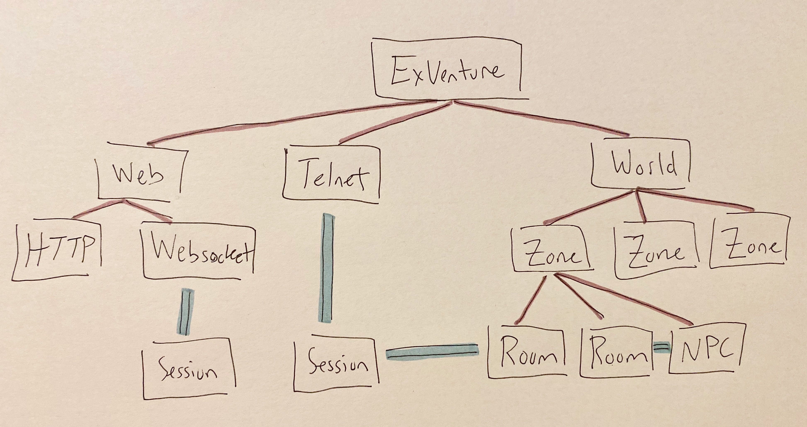

---


# Connecting to the World

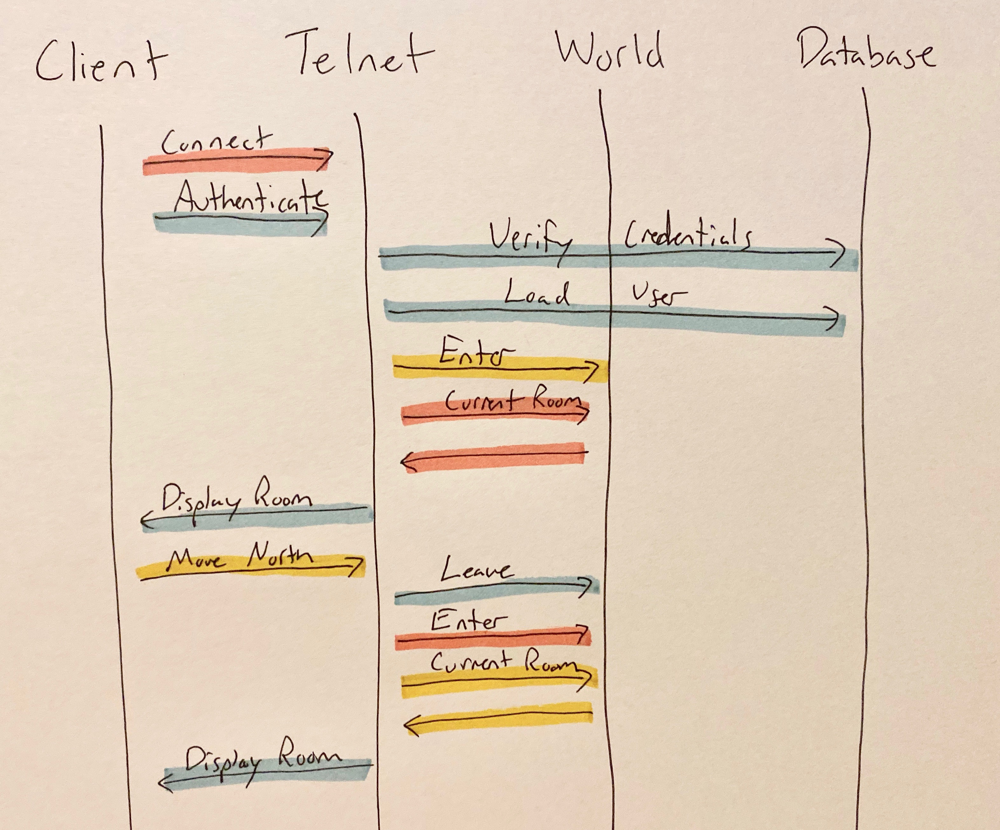

---


# Players Acting on the World

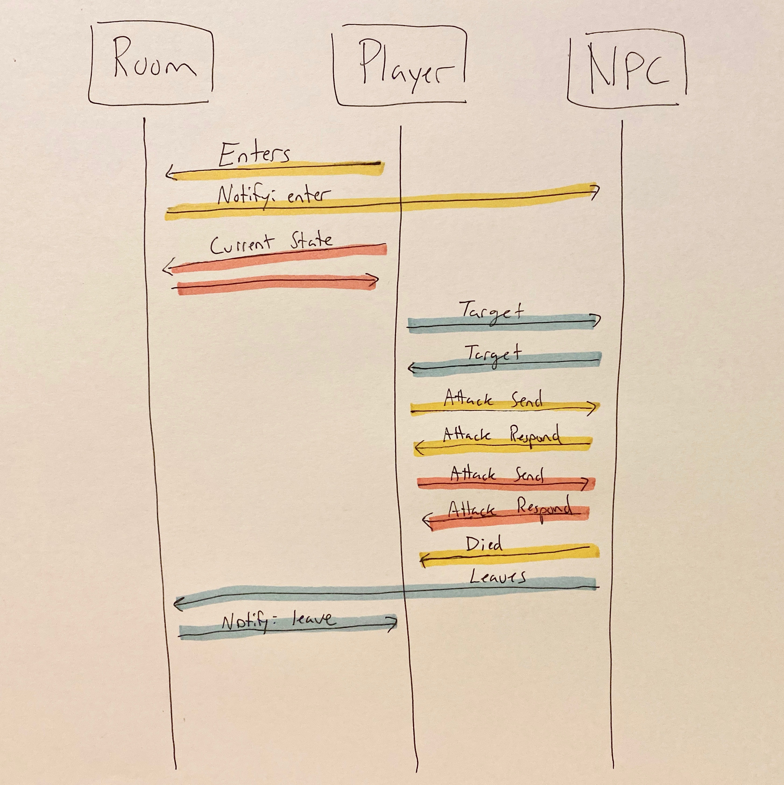

^ Notice no DB

---


# Updating a Skill from the Admin

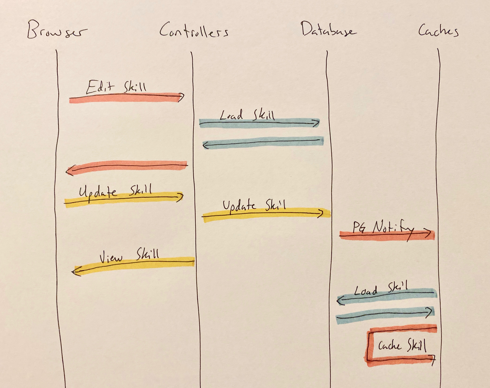

---


# Using a Skill

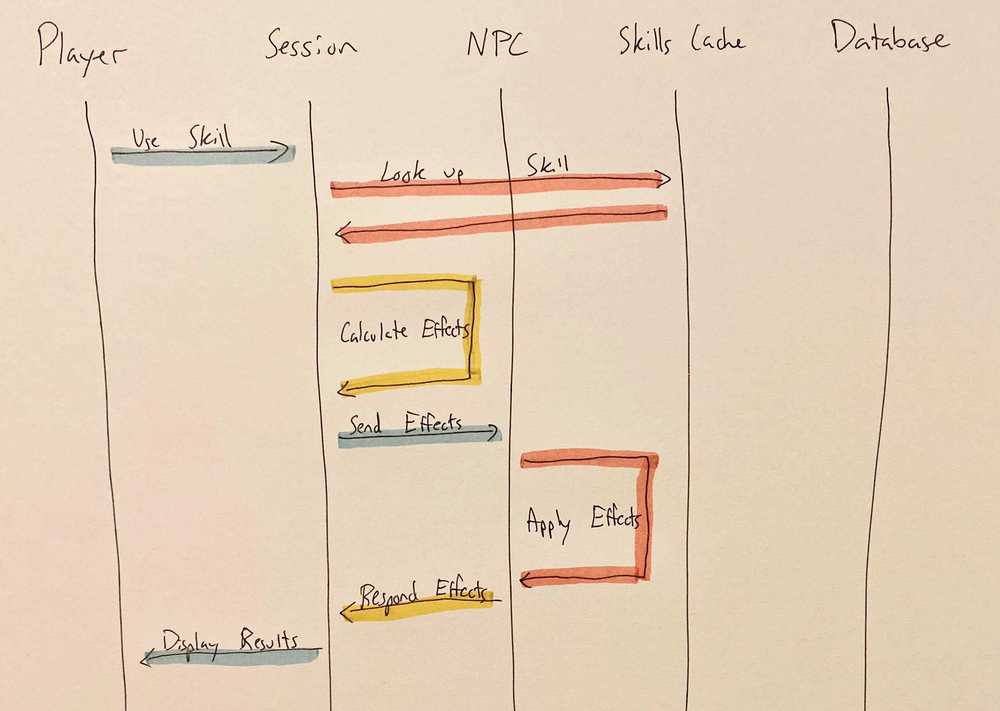

^ Notice no DB

---


# Grapevine Chat

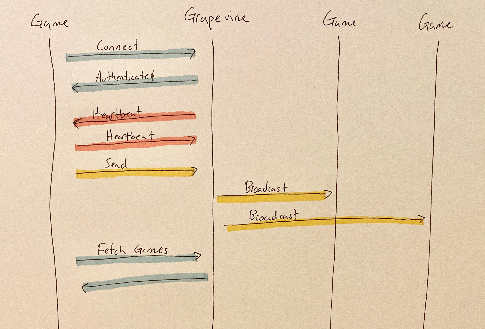

---


# Grapevine Web Telnet Client

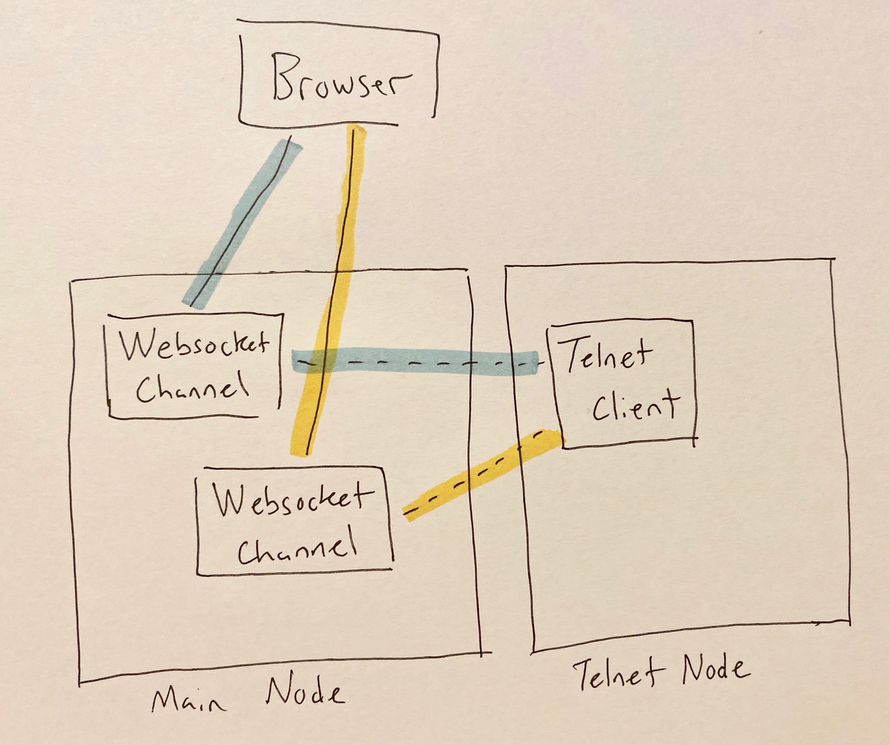

---


# Wrap Up

^ TODO roll into intro

^ elixir gives you the tools to build a very stateful application without round tripping to the db each request, performance improvements, easier to diagram, easier to architect/reason about

---


# Elixir gives you the tools to build a stateful application with ease.

^ Easier to architect and reason about

---


# Ram and CPUs are cheap, use 'em

---


# LiveView is an easy way to start stateful

^ And you can continue more stateful by sending messages to that process

---


# Finally, you might not need it

---


# GitHub

- [oestrich on GitHub](github.com/oestrich)
- [oestrich/ex_venture](https://github.com/oestrich/ex_venture)
- [oestrich/grapevine](https://github.com/oestrich/grapevine)

---


[.text: alignment(center)]

# Titans of Text

[titansoftext.com](https://www.titansoftext.com)

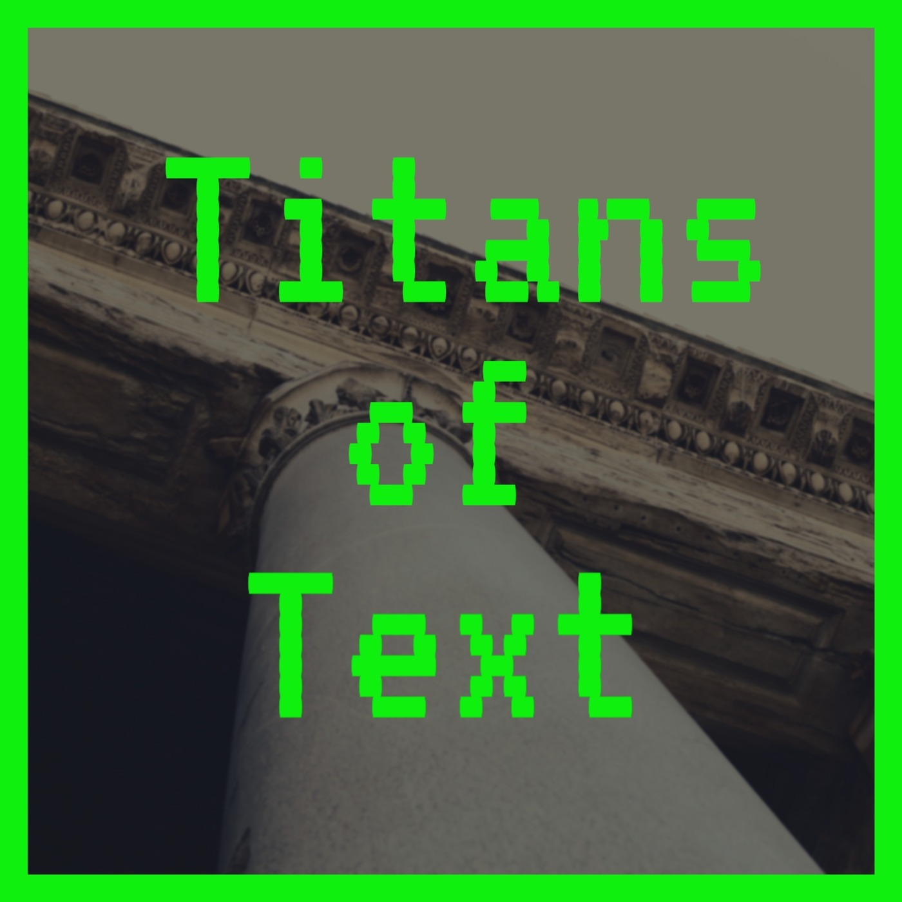

---


[.text: alignment(center)]

# Season 3 of Smart Software

[podcast.smartlogic.io](https://podcast.smartlogic.io)


---


[.text: alignment(center)]

# Season 3 of ~~Smart Software~~
# Elixir Wizards

[podcast.smartlogic.io](https://podcast.smartlogic.io)

---

[.header: #FDDF26, text-scale(1.5), Circular Std]

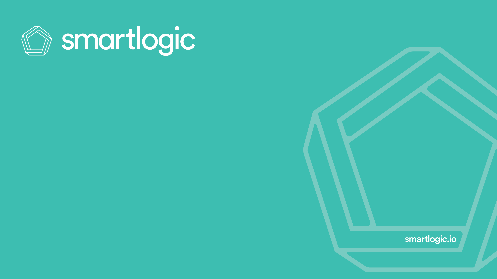

# Thanks!
