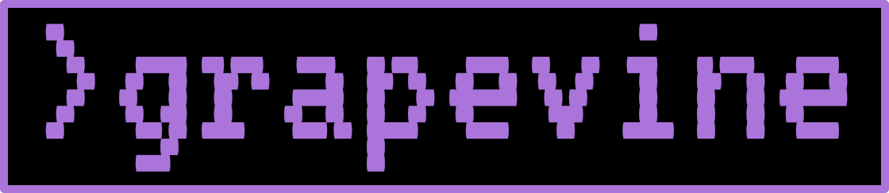

# All Aboard the Stateful Train
### Going Beyond a Standard Phoenix Application

[.header: #FDDF26, text-scale(2.5)]
[.text: #FFFFFF]


Eric Oestrich
SmartLogic

^ maybe throw in a couple examples of stateful apps that aren’t yours? just for helping folks imagine when they might want to be stateful
^ maybe add along with your easy steps to being more stateful section a little bit on when stateful makes sense
^ only other thought is if there’s anything you would apply from stateful thinking to non-stateful apps, could add that in the wrapup, or maybe, questions you might ask yourself to help determine whether you should think about making yr app stateful (i am sort of repeating myself here w/ my comment above)
^ one other thought is if you ever found yourself walking down a path of trying to make exventure work w/o state, sort of showing how gnarly that would be to try to make work could help make the point of ‘why stateful’
^ sometimes showing how complicated one path gets can help show why it’s a bad idea / where a given system breaks down and you need to look to a diff kind of structure, or on the stateful apps example, you could talk about non-web apps that are stateful and why state is important to them

---


# Who am I?

Eric Oestrich
Wizard at SmartLogic

---


# Who is SmartLogic?

We build custom web and mobile apps.

Based in Baltimore, we've built over 150 apps since 2005.

---


# Agenda

- What does a standard application look like?
- Why would you go stateful?
- What does a stateful application look like?
- Is stateful better?
- Let's go stateful!

---


# Standard Application

---


# Standard Application

- Stateless HTTP
- Controllers go straight to the database
- Does not leverage OTP
- MVC, Rails-like

^ TODO How does data flow through this?

---


# Standard Application Examples

- Blog, e.g. Wordpress
- CRM, e.g. Hubspot
- Wiki, e.g. Wikipedia
- Ecommerce, e.g. Shopify

---


# Stateful Application

- Stateless HTTP
- Websockets/TCP connections
- Heavy use of OTP
- "Background" processes

^ TODO How does data flow through this?

---


# OTP and Processes

- Open Telecom Platform
- OTP is the standard library of Erlang
- GenServers, supervision trees, :ets, all the fun stuff
- Processes are the base building block of Erlang concurrency

---


# Supervision Tree


---


# Why Stateful?

---


# Why Stateful?

- We're on a platform that can handle it
- Local caches
- Processes working on state

---


## Did I mention Erlang is great at this?


[.footer: https://unsplash.com/photos/M5tzZtFCOfs]

---


# Let's review some stateful applications

---

[.text: alignment(center)]


# ExVenture

A MUD Server
[exventure.org](https://exventure.org)


---


# What is a MUD?

- Multi-User [Dungeon](https://en.wikipedia.org/wiki/Dungeon_\(video_game\))
- Online text adventure
- Connects with telnet

---


# What is a text adventure?

```
This is an open field west of a white house, with a boarded front door.
There is a small mailbox here.
A rubber mat saying 'Welcome to Zork!' lies by the door.

>
```

---


# MidMUD

The flagship ExVenture instance

[midmud.com](https://midmud.com)


---


# Review of ExVenture

- A "living" world
- Everything is always on
- The database is there for startup
- Lots of inter-process communication

---


# Demo

^ TODO diagram of how actors work together

---


# Could this be stateless?

---


# Not Really

- Poll based?
- Background worker that updated the world every X seconds?
- Gross

---


# Grapevine

[.text: alignment(center)]

MUD community site
[grapevine.haus](https://grapevine.haus)



---


# Grapevine

- Steam for MUDs
- Cross game chat
- Web client

---


# Review of Grapevine

- Close to a typical application
- State involved is websocket and telnet
- Caches

---


# Demo

- Game listings, stats
- Cross game chat
- Web client

---


# Could this be stateless?

---


# Possibly

- Chat applications _can_ poll based
- Live caches could hit the database
- Still gross

^ Hitting the db: data scale is very low

---


# Is stateful better?

^ Than a standard "rails" application

---


# Depends

---


# Do I want this?

^ Maybe
^ When should I go stateful?

---


# Depends

---


# Pros

- Soft realtime capabilities
- Website feels "alive"
- It's cool

---


# Cons

- Requires heavy usage of OTP
- Caches are Hard™
- Harder to deploy

---


# Caches are Hard™

> There are 2 hard problems in computer science: cache invalidation, naming things, and off-by-1 errors.

---


# Harder to Deploy

- Warm caches on boot
- Long lived connections will drop
  - How will you deal with this?
- Clustered applications need to handle a rolling restart

---


# Rolling Restart


---


# Here be Dragons

- Mailbox size
- Clustering woes

---


# Let's Go Stateful

---


# Easy steps to start being more stateful

- GenServers
- Supervision Trees
- :ets

---


# GenServers

- The basic building block of OTP
- Handle messages out of the HTTP process
- Background tasks
- Any kind of state you want to hang on to

---


# GenServer Example

^ TODO Maybe drop, switch to architecture?

```elixir
defmodule Counter do
  use GenServer

  def start_link(opts) do
    GenServer.start_link(__MODULE__, [], opts)
  end

  def init(_) do
    {:ok, %{count: 1}}
  end
end
```

---


# GenServer Example

```elixir
defmodule Counter do
  # ...

  def increment(pid, count \\ 1) do
    GenServer.call(pid, {:increment, count})
  end

  def handle_call({:increment, count}, _from, state) do
    state = Map.put(state, :count, state.count + count)
    {:reply, state.count, state}
  end
end
```

---


# GenServer Example

```elixir
defmodule Counter do
  # ...

  def get(pid) do
    GenServer.call(pid, :current)
  end

  def handle_call(:current, _from, state) do
    {:reply, state.count, state}
  end
end
```

---


# GenServer Example

```elixir
iex> {:ok, pid} = Counter.start_link([])
iex> Counter.inc(pid)
2
iex> Counter.inc(pid, 3)
5
iex> Counter.get(pid)
5
```

---


# Supervision Trees

Watch over your GenServers


[.footer: https://unsplash.com/photos/bt41lw9i6Kc]

---


# Supervision Tree Example

```elixir
defmodule Counters do
  use Supervisor

  def start_link(opts) do
    Supervisor.start_link(__MODULE__, [], opts)
  end

  def init(_) do
    children = [
      {Counter, []}
    ]

    Supervisor.init(children, strategy: :one_for_one)
  end
end
```

---


# Dynamic Example

```elixir
defmodule Counters do
  use DynamicSupervisor

  def start_link(opts) do
    DynamicSupervisor.start_link(__MODULE__, [], opts)
  end

  def start_client(pid, opts) do
    spec = {Counter, opts}
    DynamicSupervisor.start_child(pid, spec)
  end

  def init(_) do
    DynamicSupervisor.init(strategy: :one_for_one)
  end
end
```

---


# Dynamic Example

```elixir
iex> {:ok, counter1} =
  Counters.start_child(supervisor_pid, [])
iex> {:ok, counter2} =
  Counters.start_child(supervisor_pid, [])
iex> Counter.inc(counter1)
2
iex> Counter.inc(counter1)
3
```

---


# :ets

- Erlang Term Storage
- Very fast reads/writes
- Concurrent
- Downside: copies memory a lot

[.footer: http://erlang.org/doc/man/ets.html]

---


# :ets Example

```elixir
defmodule Items do
  use GenServer
  # ...

  def init(_) do
    :ets.new(__MODULE__, [:set, :protected, :named_table])
    # ...
  end

  def handle_cast({:update, item}, state) do
    :ets.insert(__MODULE__, {item.id, item})
    {:noreply, state}
  end
end
```

---


# :ets Example

```elixir
defmodule Items do
  # ...

  def get(id) do
    case :ets.lookup(__MODULE__, item_id) do
      [{^item_id, item}] ->
        {:ok, item}

      [] ->
        {:error, :not_found}
    end
  end

  # ...
end
```

---


# :ets Example

```elixir
iex> potion = %Item{name: "Potion"}
iex> {:ok, items} = Items.start_link([])
iex> Items.update(potion)
:ok
iex> Items.get(potion.id)
{:ok, %Item{name: "Potion"}}
```

---

# Other OTP Goodies

- `:pg2`
- `:mnesia`

---


# Wrap Up

---


# Wrap Up

- Stateful can be useful if you need
- You may not need it

---


[.text: alignment(center)]

# Season 3 of Smart Software

[podcast.smartlogic.io](https://podcast.smartlogic.io)


---


[.text: alignment(center)]

# Season 3 of ~~Smart Software~~
# Elixir Wizards

[podcast.smartlogic.io](https://podcast.smartlogic.io)

---


# Questions?

