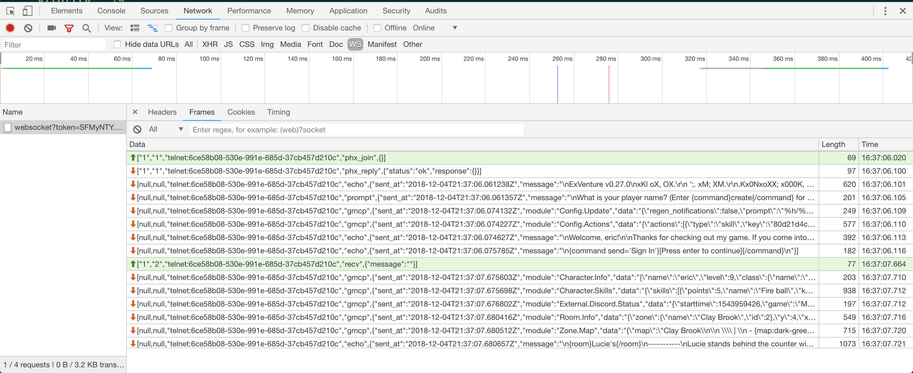

# Intro to WebSockets

---

## The WebSocket Protocol - RFC 6455

The WebSocket Protocol enables two-way communication between a client running untrusted code in a controlled environment to a remote host that has opted-in to communications from that code.

[RFC 6455](https://tools.ietf.org/html/rfc6455)

---

## Basics

- Binary Protocol
- Upgrades HTTP 1.1
- Uses frames

---

### Frames

- Used for controlling the socket and sending data
- Contains a header that explains the data message

---

### Frames (cont.)

[.code: alignment(center)]

```
 0                   1                   2                   3
 0 1 2 3 4 5 6 7 8 9 0 1 2 3 4 5 6 7 8 9 0 1 2 3 4 5 6 7 8 9 0 1
+-+-+-+-+-------+-+-------------+-------------------------------+
|F|R|R|R| opcode|M| Payload len |    Extended payload length    |
|I|S|S|S|  (4)  |A|     (7)     |             (16/64)           |
|N|V|V|V|       |S|             |   (if payload len==126/127)   |
| |1|2|3|       |K|             |                               |
+-+-+-+-+-------+-+-------------+ - - - - - - - - - - - - - - - +
|     Extended payload length continued, if payload len == 127  |
+ - - - - - - - - - - - - - - - +-------------------------------+
|                               |Masking-key, if MASK set to 1  |
+-------------------------------+-------------------------------+
| Masking-key (continued)       |          Payload Data         |
+-------------------------------- - - - - - - - - - - - - - - - +
:                     Payload Data continued ...                :
+ - - - - - - - - - - - - - - - - - - - - - - - - - - - - - - - +
|                     Payload Data continued ...                |
+---------------------------------------------------------------+
```


---

## Backends

---

## Cowboy WebSocket Handler

- Low level websockets
- Dealing with frames directly

---

[.code-highlight: all]
[.code-highlight: 2]
[.code-highlight: 4-10]
[.code-highlight: 12-14]

```elixir
defmodule Web.SocketHandler do
  @behaviour :cowboy_websocket

  def init(req, opts) do
    {:cowboy_websocket, req, opts}
  end

  def websocket_init(_state) do
    {:ok, %{}}
  end

  def websocket_handle({:text, message}, state) do
    {:reply, {:text, message}, state}
  end
end
```

---

[.code-highlight: 4-6]

```elixir
defmodule Web.SocketHandler do
  # ...

  def websocket_handle({:ping, message}, state) do
    {:reply, {:pong, message}, state}
  end
end
```

---

## Phoenix Channels

- Higher Level
- Abstraction around websockets
- Implements its own protocol on top of websockets

---

[.code-highlight: all]
[.code-highlight: 4]
[.code-highlight: 6-14]
[.code-highlight: 16]

```elixir
defmodule Web.CharacterSocket do
  use Phoenix.Socket

  channel("chat:*", Web.ChatChannel)

  def connect(%{"token" => token}, socket) do
    case Phoenix.Token.verify(socket, "character socket", token) do
      {:ok, character_id} ->
        {:ok, assign(socket, :character_id, character_id)}

      {:error, _reason} ->
        :error
    end
  end

  def id(socket), do: "characters:#{socket.assigns.character_id}"
end
```

---

[.code-highlight: 4-12]

```elixir
defmodule Web.ChatChannel do
  use Phoenix.Channel

  def join("chat:" <> channel, _message, socket) do
    case Map.has_key?(socket.assigns, :character_id) do
      true ->
        assign_character(socket, channel)

      false ->
        {:error, %{reason: "character required"}}
    end
  end
end
```

---

## Clients

---

## Elixir

- WebSockex
- Gun

---

### WebSockex

- Callback inspired approach
- Only a websocket client

---

[.code-highlight: all]
[.code-highlight: 4-10]
[.code-highlight: 12-14]

```elixir
defmodule Gossip.Socket do
  use WebSockex

  def start_link() do
    WebSockex.start_link(url(), __MODULE__, state, [name: Gossip.Socket])
  end

  def handle_connect(_conn, state) do
    {:ok, state}
  end

  def handle_frame({:text, message}, state) do
    {:ok, state}
  end
end
```

---

### Gun

- From the makers of `cowboy`
- Similar flow to `gen_tcp`

---

[.code-highlight: all]
[.code-highlight: 2-6]
[.code-highlight: 8-10]
[.code-highlight: 12-15]

```elixir
defmodule Gossip.Socket do
  use GenServer

  def start_link() do
    GenServer.start_link(__MODULE__, state, [name: Gossip.Socket])
  end

  def init(_) do
    {:ok, state, {:continue, :connect}}
  end

  def handle_continue(:connect, state) do
    {:ok, pid} = :gun.open(String.to_charlist(hostname), portnum)
    {:noreply, Map.put(state, :conn, pid)}
  end
end
```
---

[.code-highlight: 2-5]
[.code-highlight: 7-9]
[.code-highlight: 11-13]

```elixir
defmodule Gossip.Socket do
  def handle_info({:gun_up, from, _protocol}, state) do
    _ref = :gun.ws_upgrade(state.conn, String.to_charlist(path))
    {:noreply, state}
  end

  def handle_info({:gun_upgrade, from, _, _, _}, state) do
    {:noreply, state}
  end

  def handle_info({:gun_ws, _from, _ref, frame}, state) do
    {:noreply, state}
  end
end
```

---

## JavaScript

---

### Phoenix Socket JS

---

[.code-highlight: all]
[.code-highlight: 1-2]
[.code-highlight: 4-7]
[.code-highlight: 8-11]

```javascript
let socket = new Socket("/socket", {params: {token: token}});
socket.connect();

let channel = socket.channel("chat:global", {})
channel.on("broadcast", (data) => {
  console.log(data);
});
channel.join().
  receive("ok", (e) => {
    console.log("Connected!");
  });;
```

---

### Plain JS

---

[.code-highlight: all]
[.code-highlight: 1]
[.code-highlight: 3-5]
[.code-highlight: 7-9]
[.code-highlight: 11-13]

```javascript
let socket = new WebSocket("/socket");

ws.onopen = function() {
  console.log("Opened");
}

ws.onmessage = function(message) {
  console.log(message);
}

ws.onclose = function() {
  console.log(message);
}
```

---

## Inspecting WebSockets

- Open the dev tools -> Networking -> WS
- Click on the connection -> Frames



---

## Questions?
